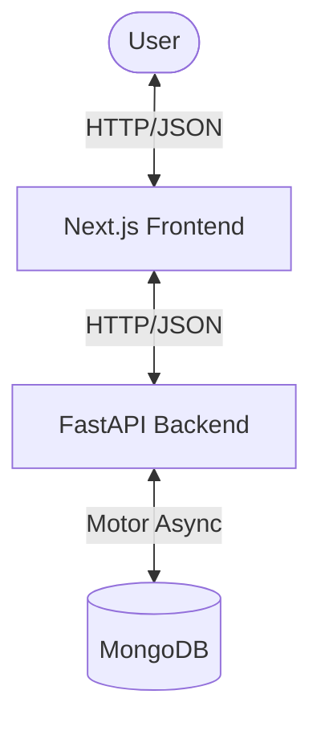
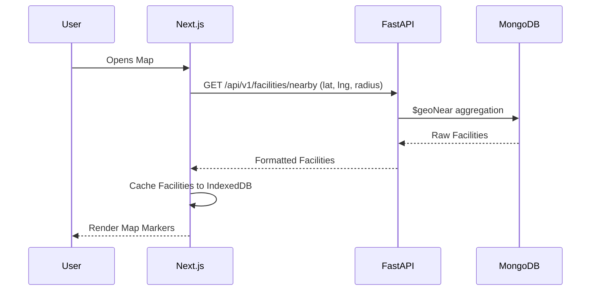
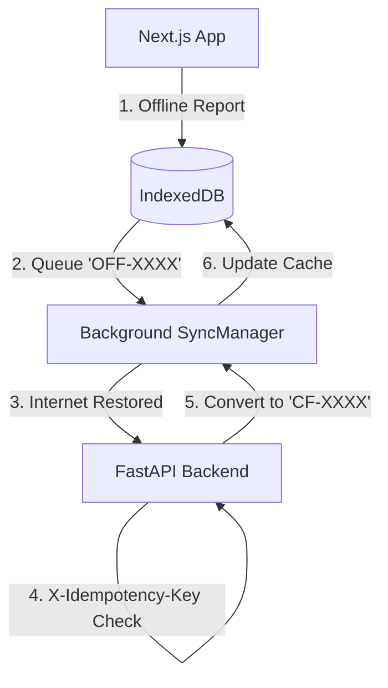
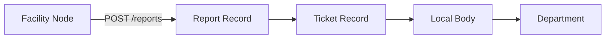

# CivicLens Architecture

CivicLens uses a modern, decoupled architecture designed for both performance and reliability in environments with intermittent connectivity.

## High-Level Data Flow

The application consists of a Next.js (React) frontend that communicates with a FastAPI (Python) backend, which persists data in a MongoDB database.

## Online Facility Flow
When the user has an active internet connection, the frontend fetches facilities via geolocation or text search directly from the FastAPI backend.

## Offline Strategy and Idempotency
CivicLens implements an offline-first caching layer and a background synchronization engine to guarantee that users can continue to use the application and report problems even when internet access is lost.

### Components
1. **IndexedDB (idb)**: Stores facilities, sync metadata, cached tickets, and a pending report queue.
2. **Network Hook**: A global listener detects browser `online`/`offline` events.
3. **Idempotency Key**: Every offline report is assigned a UUID. When the sync manager POSTs the report to the backend, it passes `X-Idempotency-Key` in the headers. The backend leverages a `unique`, `sparse` MongoDB index to ensure that if the sync manager accidentally retries a successful request, the backend gracefully returns the existing ticket without duplicating it.

## Civic Reporting Flow
When an issue is reported, the backend explicitly routes the ticket to the simulated Local Body and relevant Department based on the facility's metadata.

